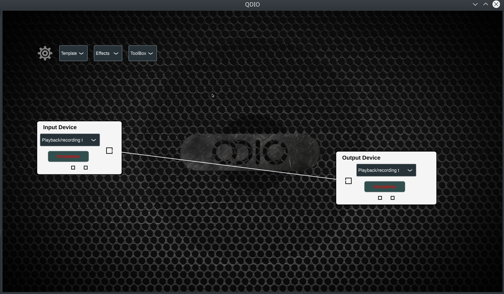
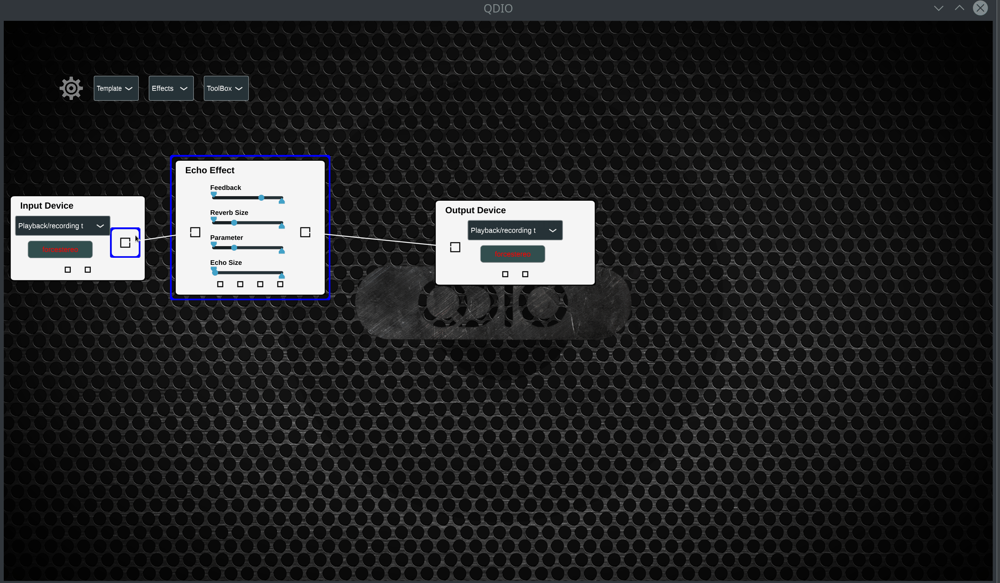
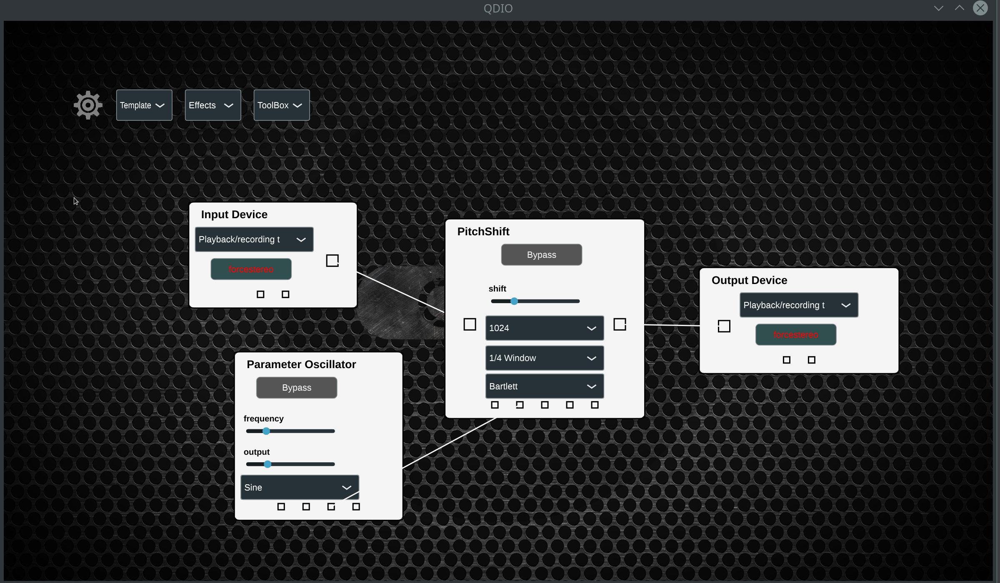

# QDIO EFFECTS CREATOR - A guitar effects creation platform

The QDIO App is an intuitive platform where guitarists can create and modify effects based on a building-block system, allowing for greater flexibility and customizability than ever seen before.

The app is built using the [JUCE Audio Framework](https://github.com/juce-framework/JUCE).

### Features:

The App uses a simple drag-and-drop style interface for all interactions.

Using the building-block effects as internal components, one can create "meta-effects" with integrated parameters.

Additionally, automatic parameters can be linked to effect parameters, to make more complex, dynamic and reactive effects.

The Effects can be shared via file export/import, allowing those who create complex systems to share them to the world.

------

### Development:

If you try the app, you'll see that it likely won't survive more than a few minutes. This is because I have not set aside a stable version yet, even back when I had one. Thus, these are the current objectives to reach for the first official stable version:

- **Better Building Blocks**: The building blocks introduced so far are courtesy of [Juan's Audio-Effects Project](https://github.com/juandagilc/Audio-Effects), but they are built for standalone use. For example, any internal lfo can be removed and replaced with a *Parameter Oscillator*.
- **Stable file share system**: For now, files are not usable between patches, and that's too rough to be official. Some file checker system to deal with changing building-block parameters is necessary.
- **Separate Logical-Audio and UI Systems**: JUCE conveniently allowed me to manage everything under the same classes, but it ended being quite messy, so using a message-passing system the Logical/Audio side and the UI should be separated. It will also allow for easier deployment onto different platforms, and perhaps replacing the current UI with another system altogether.
- **Integrated Channel system**: For now, channel usage has been messy and mostly maintained by trial-and-error alongside JUCE Default systems. With a better integrated Logical/Audio system, channels should be easier to manage and configure.
- **Improved Parameter Flexibility and Updating**: The basis of the parameter system is in place, but for a complete system, any parameter's range should be customizable. (And maximum range should be extended on all effects). Meta-parameters and auto-parameters should integrate connected parameters' range. The parameter system should also fully be run by the audio system, and the UI should only update at a specific framerate, and be able to send messages to the audio system on user interaction.

That's enough for now. A few more features that interest me are:

- Visual components for sound analysis
- Multiple Device integration (extending the JUCE AudioDeviceManager functionality)
- Audio Recording and Playback ( - but first, loop pedals.)
- Separate audio stream system for Fourier-Transform-based effects (rather than re-doing the transform back and forth on every effect)
